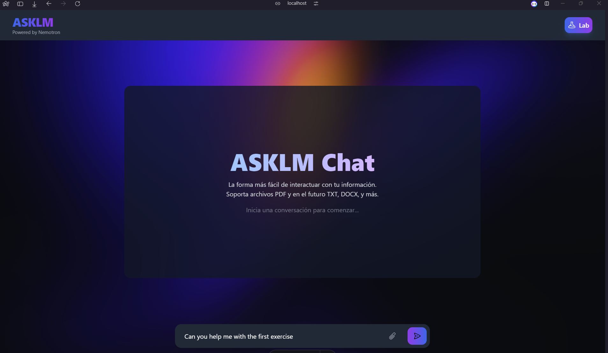

# Proyecto RAG-X: Sistema de Recuperación y Generación Aumentada

## 🌟 Visión General

RAG-X es un sistema completo de Recuperación y Generación Aumentada (RAG) que combina una potente API backend con una interfaz de usuario moderna y accesible. El sistema está diseñado para procesar consultas en lenguaje natural y proporcionar respuestas precisas basadas en fuentes de conocimiento específicas.

## 🎯 Demostración

### Interfaz de Usuario


*Vista principal de la aplicación*

### Flujo de Trabajo


*Ejemplo de una consulta y respuesta*

## 🏗️ Arquitectura del Sistema

El proyecto está dividido en dos componentes principales:

### Frontend (rag-ui/)

- Interfaz de usuario moderna construida con Next.js y TypeScript
- Diseño responsive y accesible
- Gestión eficiente de estados y consultas
- [Ver documentación del Frontend](./rag-ui/README.md)

### Backend (rag-api/)

- API RESTful construida con FastAPI
- Procesamiento de lenguaje natural
- Integración con bases de conocimiento
- [Ver documentación del Backend](./rag_backend/README.md)

## 🚀 Inicio Rápido

1. Clona el repositorio:

```bash
    git clone https://github.com/ASKhem/proyect-ragx.git
    cd proyect-ragx
```

2. Lee los archivos README.md de cada carpeta para obtener más información sobre cómo configurar y ejecutar el proyecto.


## 📋 Requisitos del Sistema

- Python 3.8+
- Node.js 16+
- npm 7+
- Memoria RAM: 8GB mínimo recomendado
- Espacio en disco: 2GB mínimo

## 🤝 Contribución

Las contribuciones son bienvenidas. Por favor, revisa nuestras guías de contribución en [CONTRIBUTING.md](./CONTRIBUTING.md).

## 📄 Licencia

Este proyecto está bajo la Licencia MIT. Ver [LICENSE](./LICENSE) para más detalles.

## 📞 Contacto

- Email: khemwirtz@gmail.com
- GitHub Issues: Para reportar problemas o sugerir mejoras
