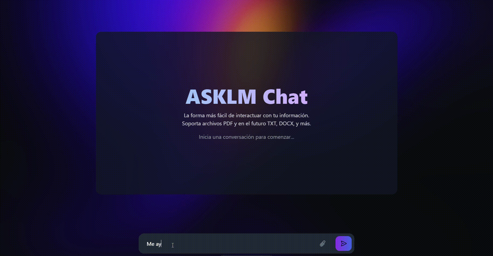

# Proyecto RAG-X: Sistema de Recuperación y Generación Aumentada

## 🌟 Visión General

RAG-X es un sistema completo de Recuperación y Generación Aumentada (RAG) que combina una potente API backend con una interfaz de usuario moderna y accesible. El sistema está diseñado para procesar consultas en lenguaje natural y proporcionar respuestas precisas basadas en fuentes de conocimiento específicas.

## 🎯 Despliegue con Docker Compose

La forma más sencilla de ejecutar el proyecto es usando Docker Compose con las imágenes preconfiguradas.

### Prerrequisitos

- Docker y Docker Compose instalados
- Credenciales de NVIDIA API y Mongo Atlas
- 8GB RAM mínimo recomendado

consigue tu api gratis aqui: https://build.nvidia.com/nvidia/llama-3_1-nemotron-70b-instruct

### Pasos para el Despliegue

1. **Clonar el Repositorio**:

```bash
git clone https://github.com/ASKhem/proyect-ragx.git
cd proyect-ragx
```

2. **Configurar Variables de Entorno**:

```bash
# Copiar el archivo de ejemplo
cp .env.example .env

# Editar el archivo .env con tus credenciales
nano .env
```

3. **Iniciar los Servicios**:

```bash
# Descargar las imágenes y iniciar los servicios
docker-compose up -d

# Ver los logs (opcional)
docker-compose logs -f
```

**Una vez iniciado los servicios esperar unos 20 segundos a que el backend este listo.**

4. **Verificar el Despliegue**:

- Frontend: http://localhost:4321
- Backend: http://localhost:8000

### Variables de Entorno Requeridas

Asegúrate de configurar estas variables en tu archivo `.env`:

```env
# Backend Configuration
NVIDIA_API_KEY=your-nvidia-api-key
MONGODB_URL=your-mongodb-url
MONGODB_USER=your-mongodb-user
MONGODB_PASSWORD=your-mongodb-password
MONGODB_AUTH_SOURCE=admin
MONGO_DB_NAME=rag_db
MONGO_COLLECTION_NAME=documents
EMBEDDINGS_MODEL=sentence-transformers/all-MiniLM-L6-v2
CACHE_ENABLED=true
CACHE_MAX_SIZE=1000

# Frontend Configuration
PUBLIC_BACKEND_URL=http://localhost:8000
```

### Solución de Problemas Comunes

1. **Error de Conexión al Frontend**:
   - Verifica que el puerto 4321 no esté en uso
   - Asegúrate de que PUBLIC_BACKEND_URL esté correctamente configurado

2. **Error de Conexión al Backend**:
   - Verifica tus credenciales de NVIDIA y MongoDB en el archivo .env
   - Comprueba que el puerto 8000 esté disponible

3. **Problemas de Memoria**:
   - Asegúrate de tener al menos 8GB de RAM disponible
   - Verifica los recursos asignados a Docker

## 🎯 Demostración

### Interfaz de Usuario


*Vista principal de la aplicación*

### Flujo de Trabajo


*Ejemplo de una consulta y respuesta*


## 📓Podemos ver unos ejemplos sencillos en la carpeta notebooks

[Ver ejemplos en notebooks](notebooks/README.md)

##  🤖 MLL usado:

llama-3.1-nemotron-70b-instruct

- NVIDIA proporciona una serie de modelos.
- Nos regala 1000 creditos que sería casi como 5000 respuestas moderadas.

Si quieres buscar otros modelos:

https://build.nvidia.com/nvidia/llama-3_1-nemotron-70b-instruct

### API:

```bash
    from openai import OpenAI

    client = OpenAI(
    base_url = "https://integrate.api.nvidia.com/v1",
    api_key = "$API_KEY_REQUIRED_IF_EXECUTING_OUTSIDE_NGC"
    )

    completion = client.chat.completions.create(
    model="nvidia/llama-3.1-nemotron-70b-instruct",
    messages=[{"role":"user","content":"Write a limerick about the wonders of GPU computing."}],
    temperature=0.5,
    top_p=1,
    max_tokens=1024,
    stream=True
    )

    for chunk in completion:
    if chunk.choices[0].delta.content is not None:
        print(chunk.choices[0].delta.content, end="")
```

## 🏗️ Arquitectura del Sistema

El proyecto está dividido en dos componentes principales:

### Frontend (rag_ui/)

- Interfaz de usuario moderna construida con Astro y TypeScript
- Diseño responsive y accesible
- Gestión eficiente de estados y consultas
- [Ver documentación del Frontend](rag_ui/README.md)

### Backend (rag_backend/)

- API RESTful construida con FastAPI
- Procesamiento de lenguaje natural
- Integración con bases de conocimiento
- [Ver documentación del Backend](rag_backend/README.md)

## 🚀 Forma manual de ejecutar el proyecto no recomendada

1. Clona el repositorio:

```bash
    git clone https://github.com/ASKhem/proyect-ragx.git
    cd proyect-ragx
```

2. Lee los archivos README.md de cada carpeta para obtener más información sobre cómo configurar y ejecutar el proyecto.


## 📋 Requisitos del Sistema

- Python 3.8+
- Node.js 16+
- npm 7+
- Memoria RAM: 8GB mínimo recomendado
- Espacio en disco: 2GB mínimo

## 🤝 Contribución

Las contribuciones son bienvenidas. Por favor, revisa nuestras guías de contribución en [CONTRIBUTING.md](./CONTRIBUTING.md).

## 📄 Licencia

Este proyecto está bajo la Licencia MIT. Ver [LICENSE](./LICENSE) para más detalles.

## 📞 Contacto

- Email: khemwirtz@gmail.com
- GitHub Issues: Para reportar problemas o sugerir mejoras
